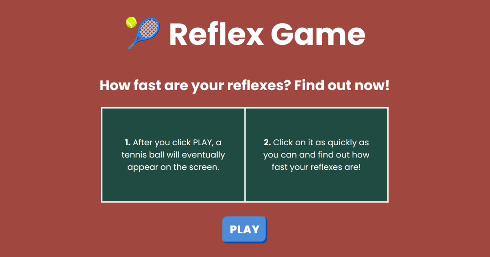

# Reflex Game

A client-side front-end Vue application, built with TypeScript, which tells a user how fast their reflexes are.

## Project Goal

The primary goal of this project is to enhance my knowledge and skills in Vue.js. This project is inspired by and credits Net Ninja's course on Vue 3.

To make it more visually interesting and engaging, I decided to build my version using a Tennis theme.

## Project Features

1. Measures a user's reaction time
1. Responsive and accessible interface
1. Engaging interface using a Tennis theme

## Project Setup

1. Run `npm install` - Install dependencies
1. Run `npm run serve` - Compiles and hot-reloads for development
1. The game will be served at `http://localhost:3000`

## Deployment

1. Run `npm run lint` - Lints and fixes files
1. Run `npm run build` - Compiles and minifies for production

## Interface

